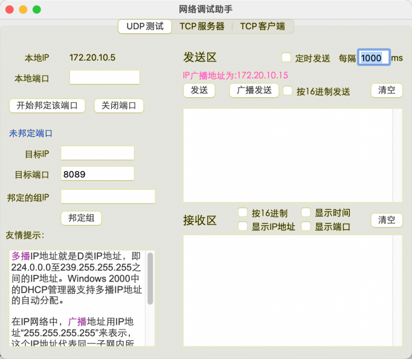
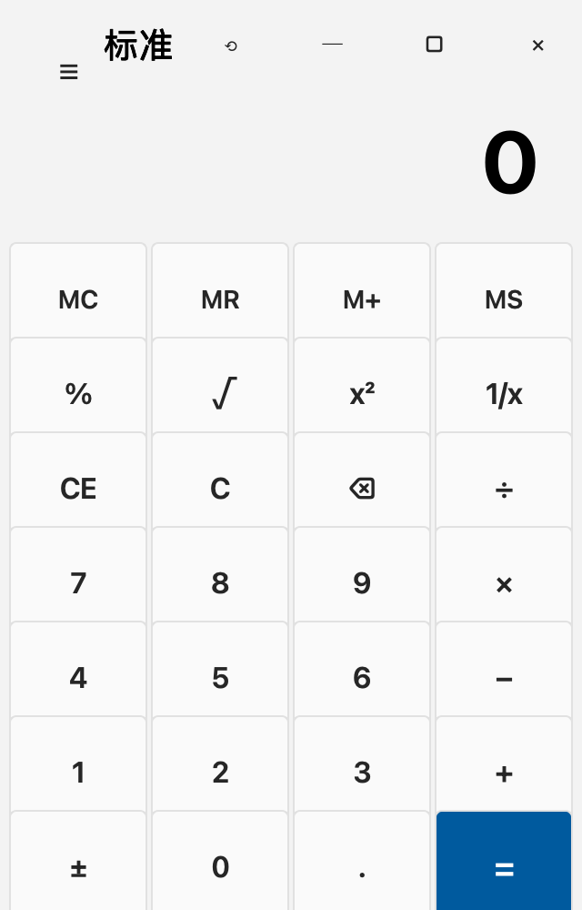

# 第一次作业

1. 不同平台下，Qt 开发环境安装，主要包括 windows、linux/mac，熟悉 QtCreator 的使用，通过 QtCreator 创建并完成项目的编译调试和发布，要求有详细截图、应用需要打包成可执行或安装文件。

2. 创建一个应用，使用命令行 qmake、nmake 命令完整创建一个 Qt 工程，编译应用等，熟悉命令行工具的使用。

3. 基础知识练习（实现设计即可）--选择其中只一即可。

（a）创建 QMainWindow 窗口实现设计计算器窗口界面。

示例参考：

（b）设计移动上网助手测速界面。

示例参考：

（c）网络调试助手窗口内容设计。保证基本合理位置前提，不限样式和整体位置。

示例参考：

# 最终作业效果：

