# 第六次作业

- 作业要求：标黄部分可选做，不做强制要求。

- 1.实现一个 HTTP 客户端，**要求实现 HTTP 上传/下载,上传下载进度展示**，实现一个 POST 请求，按照 xml/JSON 格式进行数据的展示/更新。
  实现一个 FTP 客户端，可遍历和展示整个主目录，能对文件进行上传、下载、删除等常见操作，上传/下载过程有进度展示。(两题选做一个)

- 2.创建一个应用，可获取本机所有网卡详细信息并展示，通过界面操作可实现指定修改某一个网卡的 ip、添加 ip 等操作。

- 3.实现一个 UDP 或 TCP 的客户端和服务端，实现一个简易的聊天应用、**实现点对点的文件传输。**

---

# 最终作业效果

## 作业 1（选择第一个）

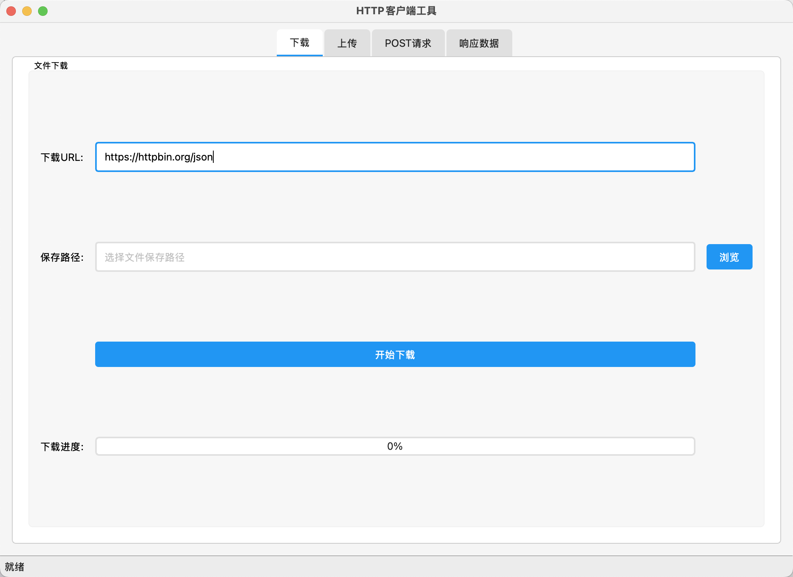

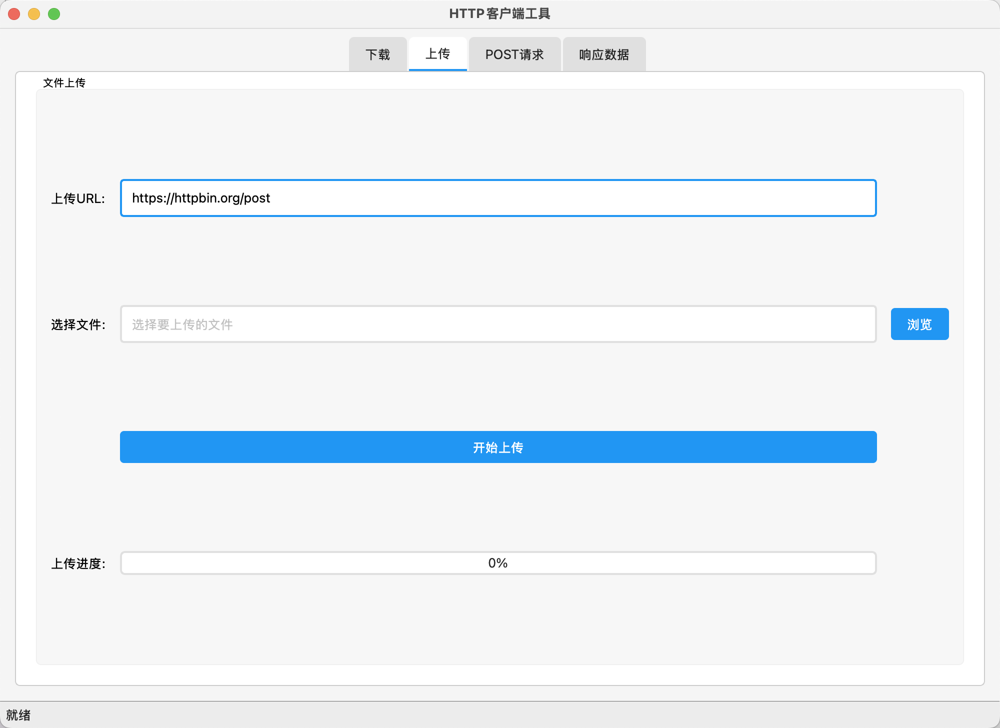

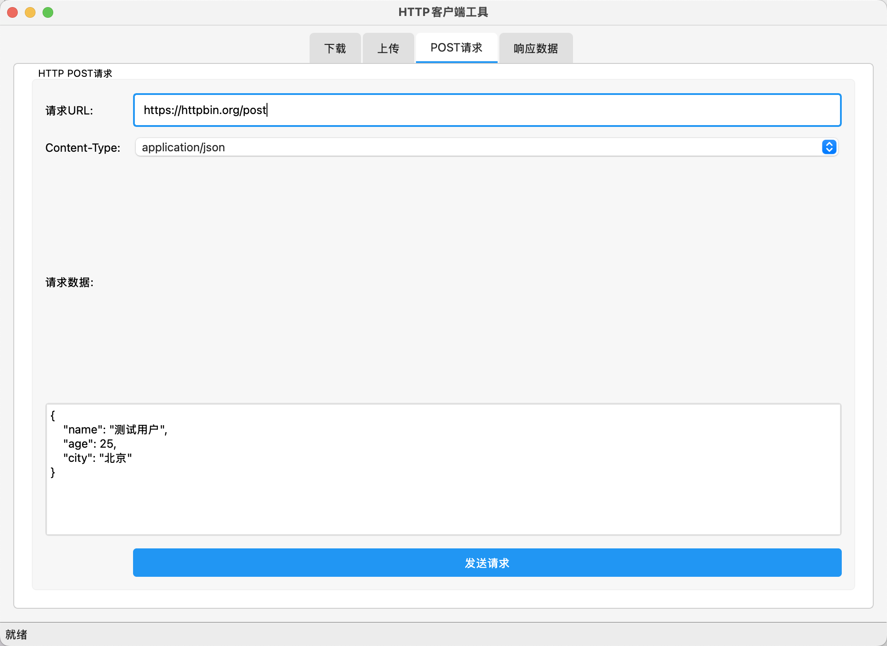

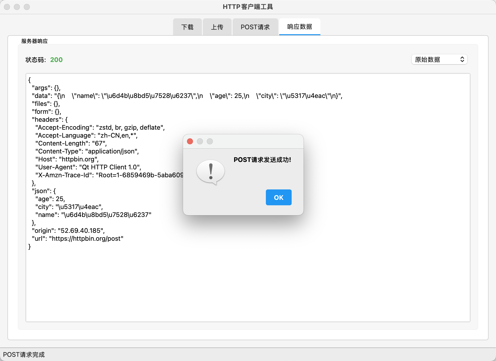

## 作业 2

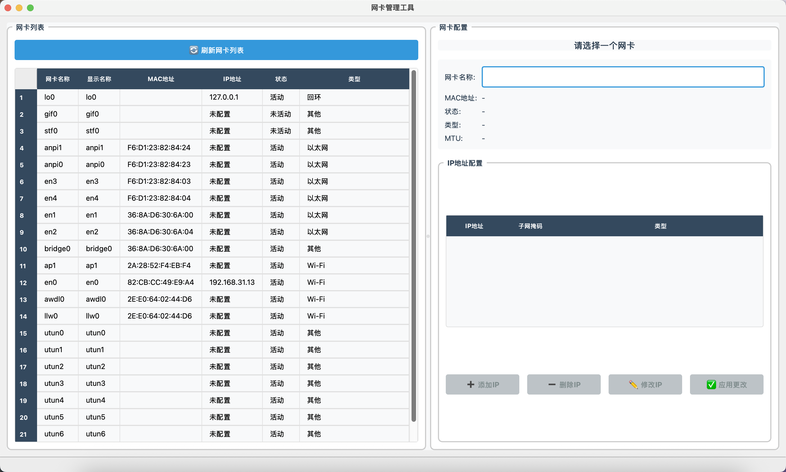

## 作业 3

### 登录

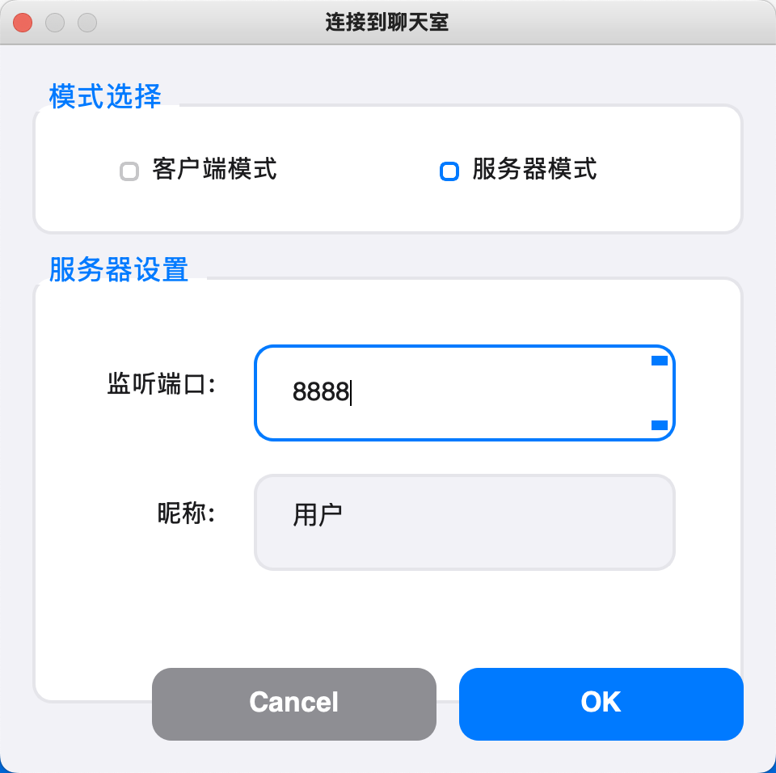

### 启动服务器

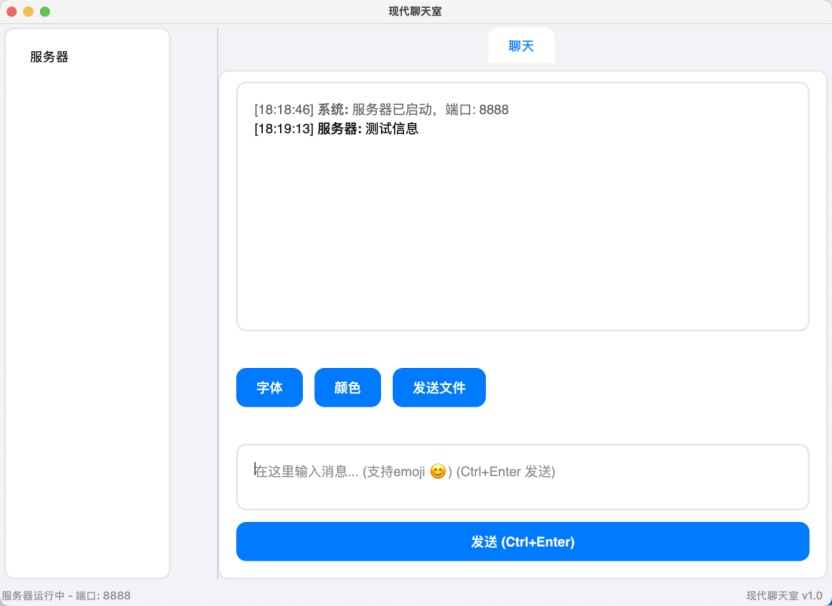

### 新建两个客户端用户，并连接到服务器

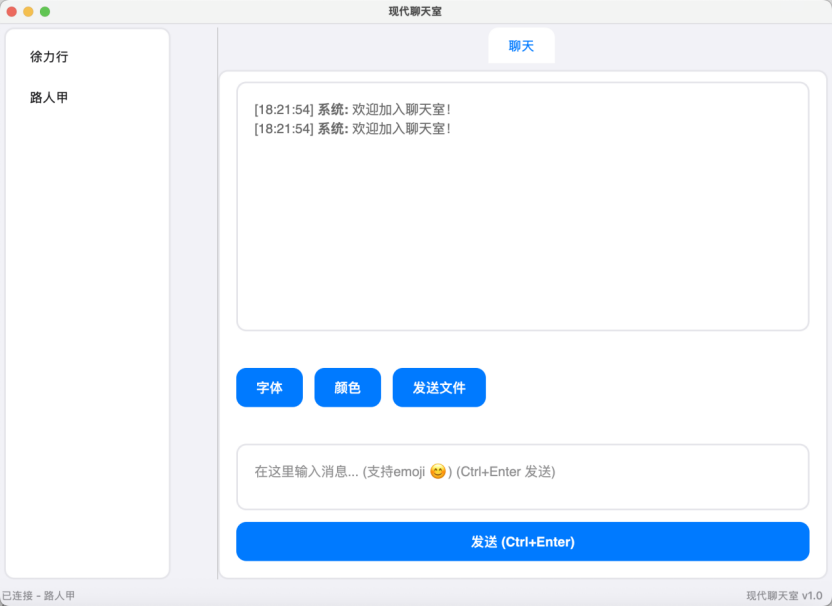

### 选择文件传输者

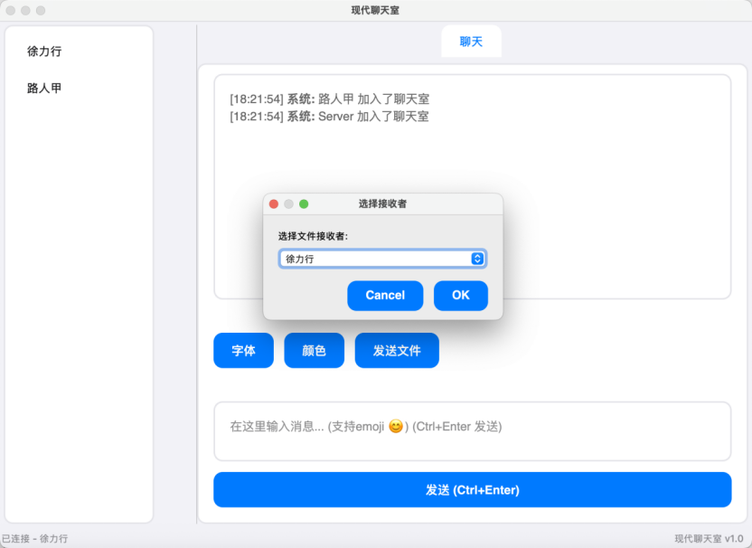

### 选择要传输的文件

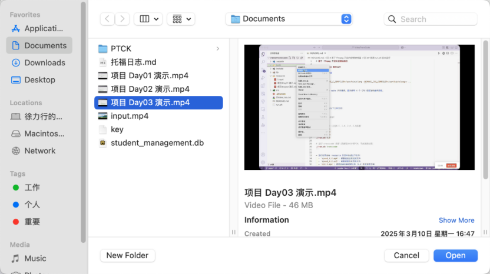

### 接收文件

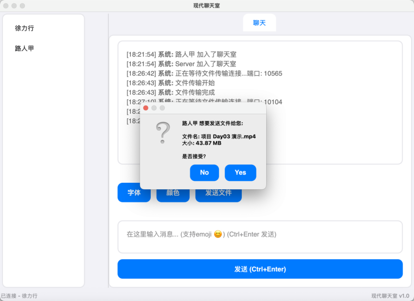

### 选择下载目录

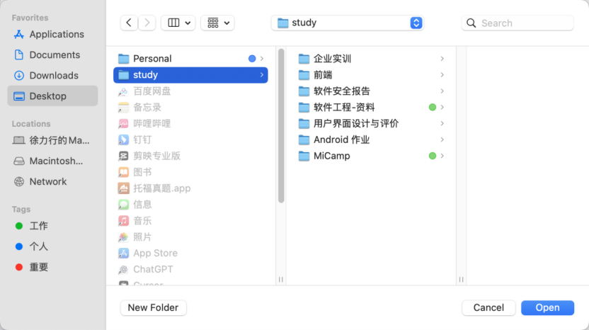

### 文件正在传输

### 文件传输完成

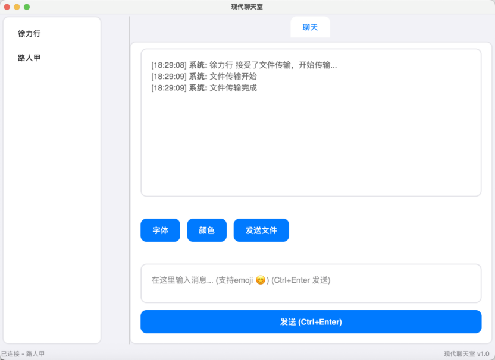

