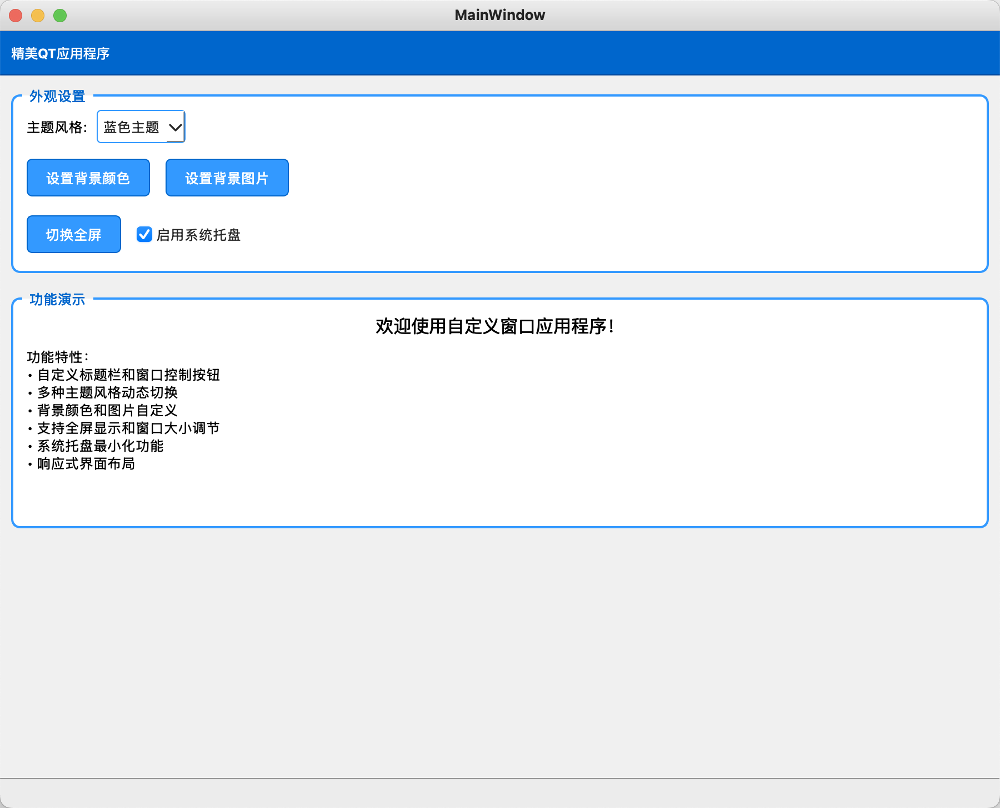
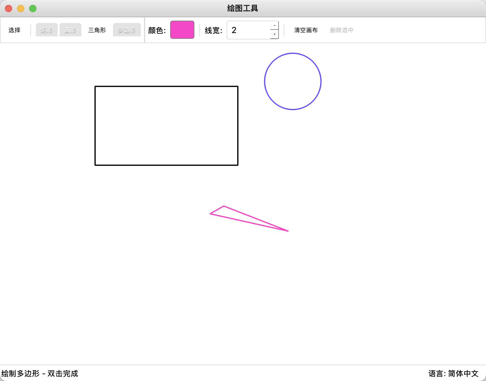
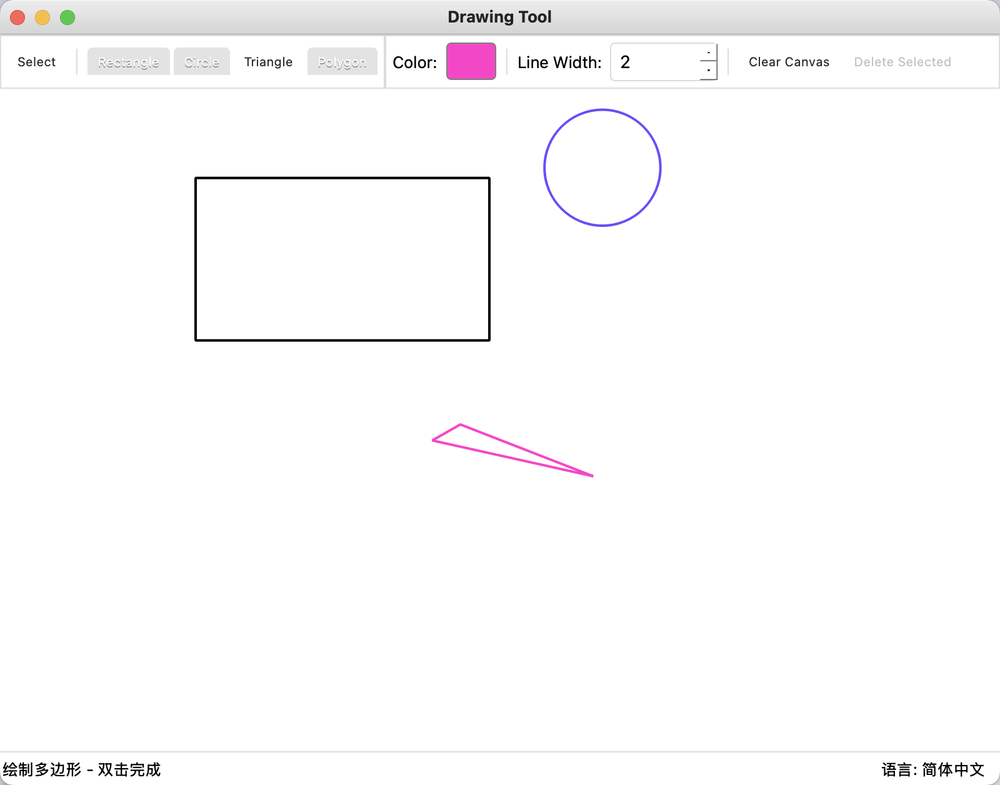

# 第八次作业

- 1、创建一个应用，实现顶一顶最小化、最大化/还原、关闭等按钮，应用背景支持设置，应用窗口支持大小调解、全屏、可最小化到托盘，通过 QSS 实现程序外观定制，且支持实现动态换肤等。

- 2、创建一个应用，支持鼠标绘制常见的图形，如：三角形、原型、矩形、多边形且可对图形大小等属性进行动态编辑。对系统界面中的所有文本进行翻译，可实现语言的动态切换，至少支持简体中文、英文等。

# 最终作业效果：

## 作业 1：

## 作业 2：

- 中文界面

- 英文界面

