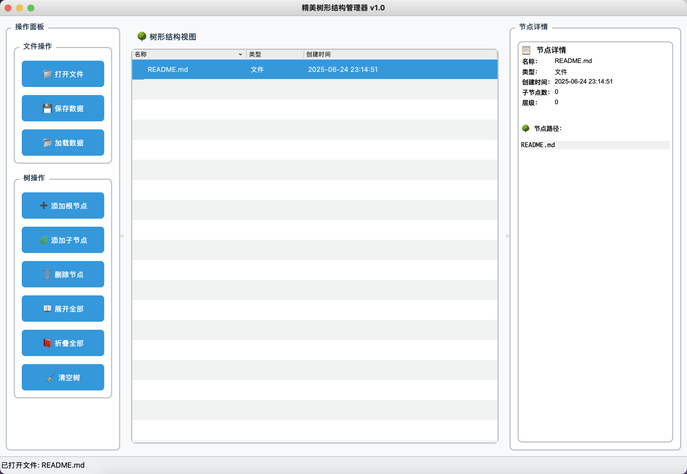
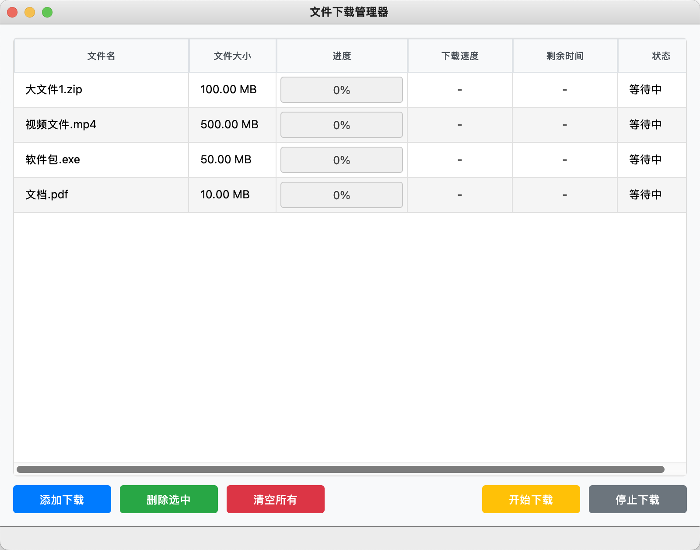

# 第九次作业

- 1.创建一个树应用，可读取文件并展示一个树形结构，树形结构的图标支持自定义，可实现快捷的重命名操作，树结构内容可以保存。

- 2.创建一个表格模型应用，实现以下功能：
  （1）添加委托（进度条）
  （2）显示文件名称、大小、进度、速度、剩余时间、状态等。
  （3）可进行添加、更新、删除、清空等操作。
  （4）实时更新数据

# 最终作业效果：

- 作业 1：

- 作业 2：

